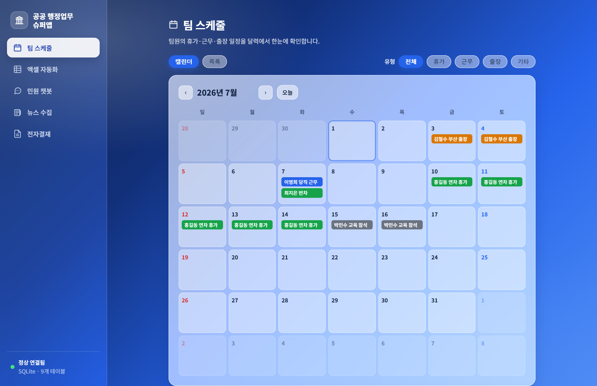
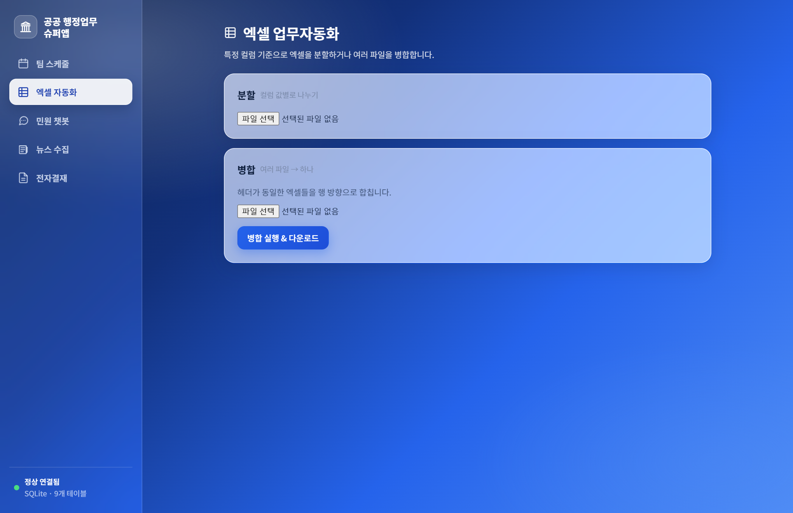
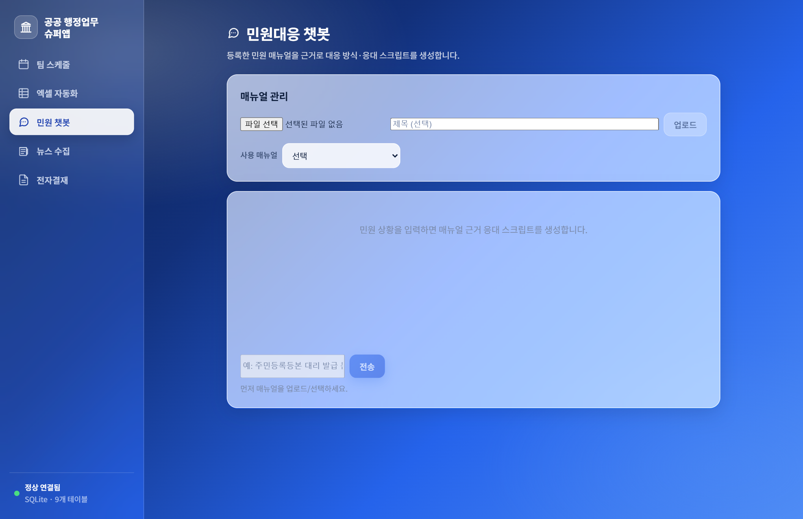
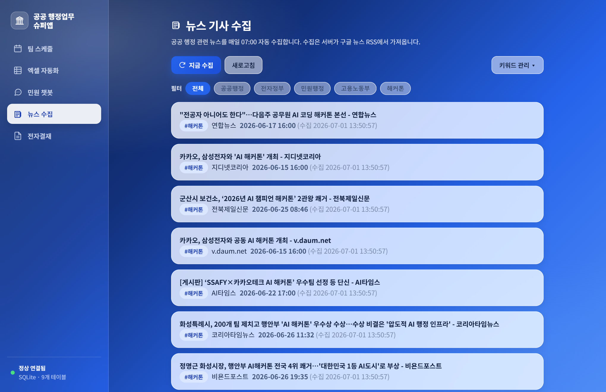
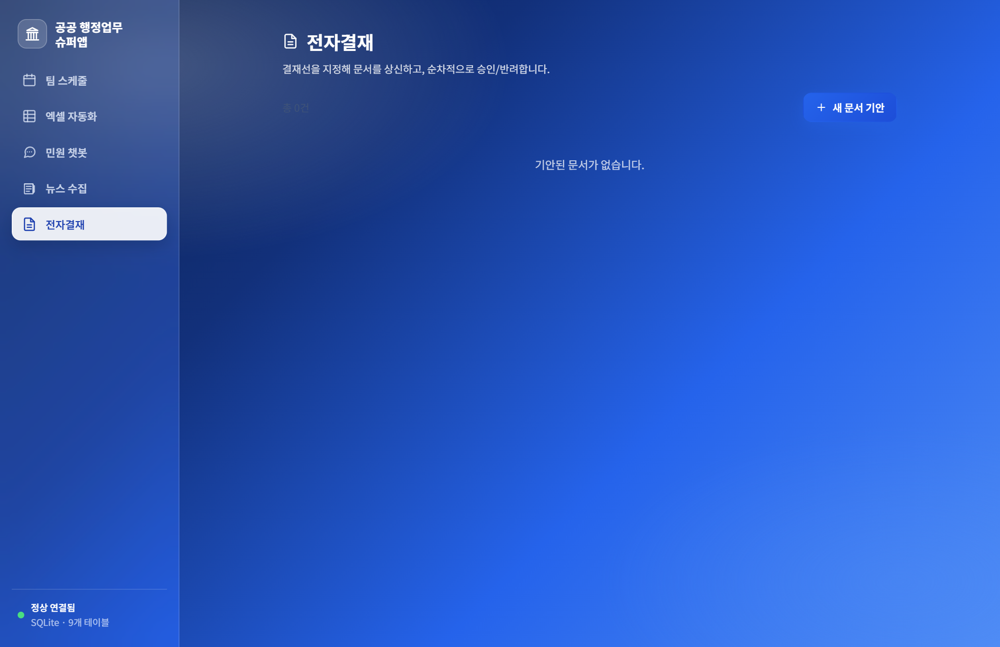

# 공공 직군 행정업무 슈퍼앱


공공 직군의 행정업무를 지원하는 슈퍼앱입니다. 기획/설계 문서는 [`docs/`](docs/)를 참고하세요
(종합 대시보드: `docs/index.html`).

## 스크린샷



<table>
  <tr>
    <td width="50%"><br/><sub><b>엑셀 자동화</b> — 컬럼 기준 분할 / 병합</sub></td>
    <td width="50%"><br/><sub><b>민원 챗봇</b> — 매뉴얼 근거 응대 생성</sub></td>
  </tr>
  <tr>
    <td width="50%"><br/><sub><b>뉴스 수집</b> — 키워드 기반 RSS 수집</sub></td>
    <td width="50%"><br/><sub><b>전자결재</b> — 순차 결재선 기안/승인</sub></td>
  </tr>
</table>

## 기능

| 기능 | 설명 |
|------|------|
| 📅 팀 스케줄 | 휴가/근무/출장 일정 공유 캘린더 |
| 📊 엑셀 자동화 | 컬럼 기준 분할 / 다중 파일 병합 |
| 💬 민원 챗봇 | 매뉴얼 근거 응대 스크립트 생성 (OpenAI GPT) |
| 📰 뉴스 수집 | 공공행정 뉴스 매일 07:00 자동 수집 (RSS) |
| 📄 전자결재 | 순차 결재선 기반 문서 기안/승인/반려 |

## 기술 스택

| 영역 | 스택 |
|------|------|
| Frontend | TypeScript + Vite + React |
| Backend | Python + FastAPI (패키지 관리: **uv**) |
| Database | SQLite |
| AI | OpenAI (`gpt-4o-mini`, `OPENAI_MODEL`로 변경 가능) |
| 부가 | pandas·openpyxl(엑셀), APScheduler(뉴스), feedparser(RSS) |

## 프로젝트 구조

```
day3_rpa/
├── docs/       # 기획·설계·운영 문서 + index.html 종합 대시보드
├── frontend/   # Vite + React + TypeScript (src/features/*)
└── backend/    # FastAPI + SQLite (uv 관리, app/*.py 기능 라우터)
```

## 실행 방법

### 0) (선택) 민원 챗봇용 API 키

챗봇 기능을 쓰려면 OpenAI API 키가 필요합니다. 없으면 챗봇만 비활성이고 나머지는 정상 동작합니다.
`backend/.env.example`을 `backend/.env`로 복사해 키를 넣으면 자동 로드됩니다.

```
# backend/.env
OPENAI_API_KEY=sk-...
# OPENAI_MODEL=gpt-4o   (선택)
```

### 1) 백엔드 (터미널 1)

```bash
cd backend
uv sync        # 최초 1회: 의존성 설치
uv run python main.py
# → http://127.0.0.1:8000  (문서: http://127.0.0.1:8000/docs)
```

### 2) 프론트엔드 (터미널 2)

```bash
cd frontend
npm run dev
# → http://localhost:5173
```

프론트엔드의 `/api` 요청은 Vite 프록시를 통해 백엔드(8000)로 전달됩니다.

## API 요약

| 기능 | 경로 |
|------|------|
| 헬스/공지 | `GET /api/health`, `GET·POST·DELETE /api/notices` |
| 스케줄 | `GET·POST /api/schedule`, `PUT·DELETE /api/schedule/{id}` |
| 엑셀 | `POST /api/excel/preview·split·merge`, `GET /api/excel/jobs` |
| 챗봇 | `GET·POST /api/chatbot/manuals`, `POST /api/chatbot/chat` |
| 뉴스 | `GET /api/news`, `GET /api/news/keywords`, `POST /api/news/collect` |
| 전자결재 | `GET·POST /api/documents`, `POST /api/documents/{id}/approve·reject` |

전체 API 문서: 백엔드 실행 후 http://127.0.0.1:8000/docs
